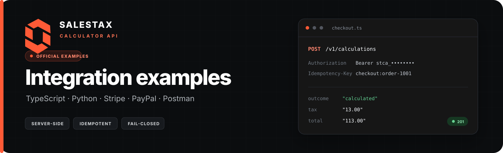
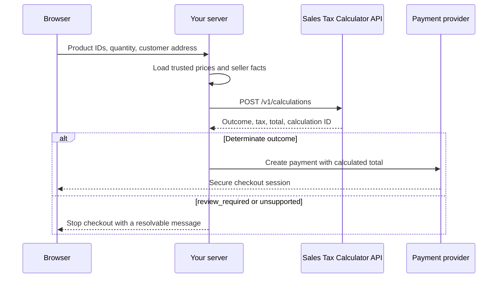

<p align="center">
  
</p>

<p align="center">
  Production-minded examples for adding sales tax calculations to real checkout and order flows.
</p>

<p align="center">
  <a href="https://github.com/InstaBlick/salestaxcalculatorapi-examples/actions/workflows/ci.yml"></a>
  <a href="./LICENSE"></a>
  
  
</p>

---

## Pick your starting point

| Example | Best for | Run it |
| --- | --- | --- |
| [TypeScript quickstart](./typescript/quickstart) | Your first server-side calculation | `npm run start -w typescript/quickstart` |
| [Python quickstart](./python/quickstart) | A small script or Python service | `python python/quickstart/quickstart.py` |
| [Stripe custom checkout](./stripe-custom-checkout) | Stripe Payment Element with tax calculated before payment | `npm run dev -w stripe-custom-checkout` |
| [PayPal Orders](./paypal-orders) | PayPal JavaScript SDK v6 with server-side order creation | `npm run dev -w paypal-orders` |
| [Postman collection](./postman) | Exploring the complete v1 resource lifecycle | Import the collection and environment |

These are examples, not SDKs. Each project keeps the HTTP boundary visible so you can copy the parts your application needs without adopting a new abstraction layer.

## Get started

1. Create a server-side API key in the [developer console](https://salestaxcalculatorapi.com/login?mode=signup&redirect=%2Fdashboard%2Fapi-keys).
2. Clone this repository and create your local environment file:

   ```bash
   cp .env.example .env
   ```

3. Replace `stca_replace_me` with your API key.
4. Install the JavaScript dependencies when using a Node.js example:

   ```bash
   npm install
   ```

5. Open the README inside your chosen example and run it.

> [!IMPORTANT]
> Keep `STCA_API_KEY`, `STRIPE_SECRET_KEY`, and `PAYPAL_CLIENT_SECRET` on your server. Never place them in browser code, mobile applications, commits, logs, or screenshots.

## The integration pattern

Every example follows the same safe boundary:



The browser never decides the price or tax. Your server owns the catalog, sends the calculation, checks its outcome, and only then creates the payment.

## Contract essentials

- Send money and quantity as decimal strings such as `"100.00"` and `"1"`.
- Authenticate with `Authorization: Bearer stca_...` from a trusted server.
- Add a unique `Idempotency-Key` to every create request.
- Treat HTTP `201` as a created calculation, then branch on `outcome` before using amounts.
- Stop automated checkout for `review_required` and `unsupported`; the API does not guess.
- Store the calculation ID, request ID, outcome, and returned amounts with your order.
- Retry only when the response explicitly says it is retryable, and honor `Retry-After`.

Read the [integration guide](https://salestaxcalculatorapi.com/docs) or browse the [OpenAPI reference](https://salestaxcalculatorapi.com/openapi.json) for the complete contract.

## Repository map

```text
salestaxcalculatorapi-examples/
├── typescript/quickstart       # Native fetch, typed response handling
├── python/quickstart           # Requests-based calculation
├── stripe-custom-checkout      # Payment Element + Payment Intents
├── paypal-orders               # JavaScript SDK v6 + Orders v2
├── postman                     # Collection and safe local environment
├── .env.example                # Placeholder credentials only
└── .github/workflows/ci.yml    # Type, syntax, test, and secret checks
```

## Before production

- Replace the demo catalog and seller registration with records from your own system.
- Validate product IDs, quantities, addresses, currencies, and authenticated customer ownership server-side.
- Persist the payment-to-calculation mapping in your database; the payment examples use memory only for a short local demo.
- Finalize successful calculations as transactions when your order becomes immutable.
- Add provider webhooks and verify every signature before fulfilling an order.
- Use your own HTTPS domain, structured logging, rate-limit handling, monitoring, and customer-safe error messages.
- Test determinate, `review_required`, `unsupported`, declined-payment, duplicate-request, and timeout paths.

## Open-source boundary

This repository contains integration examples only. The calculation engine, tax data, qualification logic, operational infrastructure, and private release packages are not included. Opening the examples makes implementation easier without turning private tax logic into a client-side dependency.

## Contributing and security

Small, focused improvements are welcome. Read [CONTRIBUTING.md](./CONTRIBUTING.md) before opening a pull request. Please report security issues privately using the process in [SECURITY.md](./SECURITY.md).

## License

The example code is available under the [MIT License](./LICENSE). Your use of the hosted API remains subject to the [Sales Tax Calculator API terms](https://salestaxcalculatorapi.com/terms).
